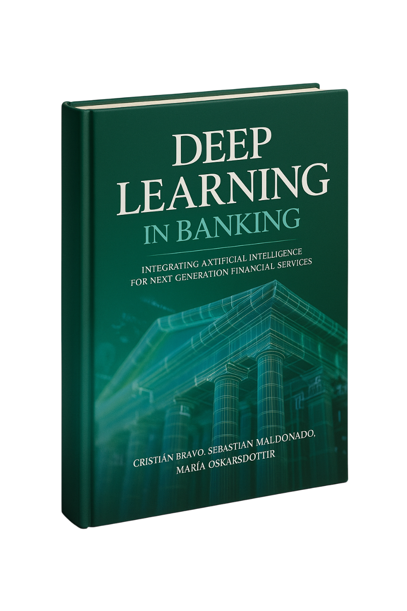

# Deep Learning in Banking



**Leveraging Artificial Intelligence for Next-Generation Financial Services**

By Cristián Bravo, Sebastián Maldonado, and María Óskarsdóttir

---

## Tech Stack

### Frontend
- **Next.js 15.2.4** - React framework with App Router
- **React 19** - UI library
- **TypeScript** - Type-safe JavaScript
- **Tailwind CSS** - Utility-first CSS framework
- **Framer Motion** - Animation library
- **Lucide React** - Icon library

### UI Components
- **shadcn/ui** - Re-usable component library
- **Radix UI** - Headless UI primitives
- **Class Variance Authority** - Component variant management

### Code Highlighting
- **Prism.js** - Syntax highlighting for Python code
- **Prism Tomorrow Theme** - Dark theme for code blocks

### Development Tools
- **PostCSS** - CSS processing
- **Autoprefixer** - CSS vendor prefixing
- **ESLint** - Code linting

### Package Management
- **npm** - Node package manager
- **pnpm** - Fast, disk space efficient package manager

---

## Getting Started

1. **Install dependencies:**
   ```bash
   npm install
   # or
   pnpm install
   ```

2. **Run development server:**
   ```bash
   npm run dev
   # or
   pnpm dev
   ```

3. **Open your browser:**
   Navigate to [http://localhost:3000](http://localhost:3000)

---

## Features

- **Interactive Labs** - Hands-on Python code examples with syntax highlighting
- **Real-time Code Animation** - Typewriter effect with live syntax highlighting
- **Responsive Design** - Mobile-first approach
- **Dark Theme** - Professional dark color scheme
- **Smooth Animations** - Framer Motion powered transitions
- **Accessibility** - WCAG compliant components

---

## Book Information

**Available December 31st, 2025**

This comprehensive resource explores the intersection of artificial intelligence and financial services, combining academic depth with practical insight to address the real-world complexities of deploying deep learning technologies in banking.

### Key Topics Covered:
- Convolutional Neural Networks (CNNs) for credit risk visualization
- LSTM and GRU architectures for delinquency forecasting
- Transformer models for financial document analysis
- Graph Neural Networks (GNNs) for loan data modeling
- Large Language Models (LLMs) for financial applications
- Multimodal data integration
- Ethical AI and model explainability

### Interactive Labs:
- 8 hands-on chapters with real-world implementations
- Google Colab integration
- GitHub repository with open-source code
- Practical fintech case studies

---

## License

© 2025 Deep Learning in Banking. All rights reserved. 